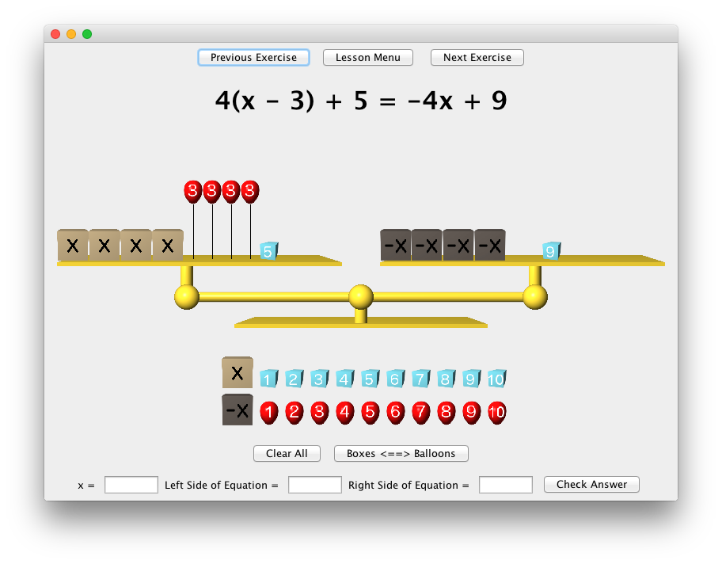

# AlgebraScale
A program to help students conceptualize the solving of linear equations

Here's a video demonstration of the program: [Algebra Scale Demonstration Video](https://www.youtube.com/watch?v=2enx-fsJMTk)

## Instructions for using Algebra Scale

To add objects to the scale
* Drag them from the bank of objects along the bottom of the screen
* Left-click on objects in the bank to add them to the left side of the scale
* Right-click on objects in the bank to add them to the right side of the scale

To remove objects from the scale
* Drag the object off the scale in any direction
* Right-click an object on the scale to remove it

To remove all objects from the scale
* Click the **Clear All** button

To change the sign of every object on the scale (multiplying both sides of the equation by -1
* Click the **Boxes <==> Balloons** button

To answer the question
* Enter the correct value of x making sure not to use approximations (for example, use 1/3 and not 0.33)
* You can use mixed fractions such as 7 1/2 instead of 15/2
* Enter the value of both the left and right hand sides of the equation after plugging in your answer
* Click the check answer button

To return to the Lesson Menu
* Click the **Lesson Menu** button
* Click **Next Exercise** when on the last exercise of a lesson

To enter your own equations
* Go to the Lesson Menu
* Click on the **Type in your own equations** button
* Type a linear equation (no exponents) using x as the variable. Parentheses can be used and nested if desired.
